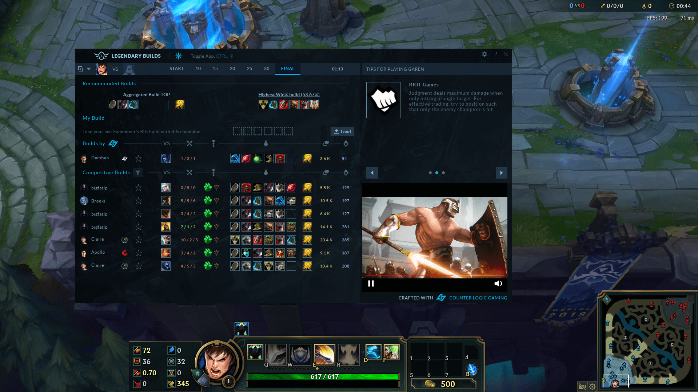

Congratulations! You’ve created a great Overwolf app loved and used by many gamers. If you want to, you can now explore monetization capabilities such as subs or ads. Please make sure to follow our guidelines, and in case you choose to have ads, create a non-intrusive in-app ad experience, ideally with an ability to subscribe.

## How does subscirptions work?

Subscription based monetization is ideal for allowing your users to enjoy an-ad free experience, get extra features/perks and support you, the creator. Introducing a Subscription plan is pretty easy as Overwolf takes care of the payments, allowing you to focus on implementation and design of premium features. 

## How does ads work?

Introducing ads in your app can help you support development while offering a free service. Please note that you cannot place ads anywhere you like as we take the game experience seriously and ads that might interfere with gameplay will not be approved. We recommend using idle times such as loading, in-between rounds and other times which do not take focus from the game.

You can also easily add image or video based ads to your app, and we'll do the rest in terms of targeting, ad inventory and paying out your revenues!

#### Ads Monetization Basics

####
1. Select the type and size of ads you wish to work with, and determine where will they be displayed visually in your app. Please review our ad policy or consult with the team if uncertain.
2. Check the [Overwolf Advertising SDK](ads-sdk-overview).
3. Ask our team to provide you with a test ad so you can verify the integration and see the ad appear live.
4. Once your ads are ready & approved, they will automatically be served to your app.
5. You will receive a personal secure dashboard showing your app's performance and revenue summaries in real time.

**What kind of ads are available?**

####
* Video ads are available in 400×300 and 300×250 sizes, we strongly recommend 400×300.
* Display banners are available in 300×250, 728x90, 300x600 and 160x600 sizes.

  <a data-fancybox="gallery" data-caption="Legendary Builds" href="../assets/LB-400x300.png">
    Legendary Builds - 400x300 video ad
    
      
    
  </a>
  <a data-fancybox="gallery" data-caption="DotaPlus" href="../assets/Dota-2-400x300.png">
    DotaPlus - 400x300 Video Ad
    
      
    
  </a>

### Advertising policy

TL;DR – **Use Forgivable Ads.** In some more words, don’t create ad experiences that you would not stand for as a gamer. Ads present a challenge and tend to provoke negative responses, but they are critical to our economy and our ability to create great apps. In general, talk to us if you're worried or unsure about your app's experience. 

Advertisers need to get continuous value from advertising on Overwolf, so to keep the CPMs high and to get more advertisers on the platform we need to provide a high-quality experience. With time, we found that it's not only about the [right time and place](https://medium.com/overwolf-developers/a-new-way-for-brands-to-engage-with-gamers-ca4cfafc5d41), but also about advertising in a balanced way.

For example, refreshing and showing new ads is only allowed when switching between app windows, pages or tabs, and never while the user is using on-screen features.

To get a more general idea, we follow the industry Standards, Guidelines & Best Practices which are provided by the IAB (read more [here](https://www.iab.com/guidelines/iab-standards-guidelines-best-practice-documents-in-public-comment/)). We also constantly scan our traffic with 3rd party anti-fraud tools to monitor quality and spot issues.

### Dos and Don’ts
**Ad Location**

* If your app has more than one view, make sure ad location is fixed and does not change when flicking through those menus.
* Ad should be visible and not hidden behind app elements (hidden ads can flag for fraud, this is important).
* Video ads aim for high completion rates to monetize well. Therefore, place video ads only in windows that have a good average open time - 30s minimum is recommended to fully view standard video ads. 
* Advertisers want to engage with the user and use their advertising budgets smartly to get maximum value. One of the ways to measure that is completion rate, which represents the number of users that watched 100% of the video ad out of the total number of users who saw the ad showing up. A good, high Completion rate is 70% or higher.
* While developing your app, put yourself in the user’s shoes. As the developer, you should find the best timing to present ads. Most games have “Dead” moments where nothing happens (Client Loading, Match Loading, post-game victory screen, etc.) so the ad won’t interrupt gameplay.
* Ads cannot be placed on the following: signup/login windows, error windows, auto-closed windows and empty windows

### Ad size

Video Players come in different sizes. Our recommendation is to use the strandard 400×300 size, which should have higher fill rates as well as higher CPM.

### Demographics

* Advertising budgets are more significant for Tier 1 countries: US, UK, CA, AU, DE, FR.
* If most of your app's users originate from Tier 1 countries, it’s likely that your CPM and yield will be higher.
* We monetize ads in lower tier countries too, but our recommendation is to focus your marketing efforts on Tier 1 countries to maximize your revenues.

