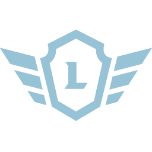

So, you’re done developing your app and it's time to submit it for review to go live on the in-game Appstore. First thing's first - Congratulations!

In this page we'll detail how you can submit your app and set yourself up for approval.

## Support page

Before your new app can go live, we recommend create a customer support page for it. We've put together advice and instructions on building support pages for your app [here](add-a-knowledge-base-to-app).

## How to Submit an App

* Please take the time to [validate your manifest](../topics/validate-your-manifest) before submitting your app for review.
* Compress all of the images/assets to reduce the final app size. You can use https://tinypng.com/ free service to compress the images.
* **Make sure you have all of the following items zipped in this structure when you send it to us:**

<pre>
myZip
  +---- app
         +---- manifest.json
         +---- IconMouseNormal.png
         +---- IconMouseOver.png
         +---- launcher_icon.ico
         +---- WindowIcon.png
         +---- Files
                +---- index.html
                +---- css
                +---- assets
  +---- store
         +---- Tile.jpg
         +---- Icon.png
         +---- ScreenshotX.jpg
         +----  description.txt
         +----  store.json

</pre>

## The "App" folder should contain

### 1. manifest.json file

Your app's [manifest.json](https://overwolf.github.io/docs/api/manifest-json#docsNav) file.

### 2. App Icons

#### 2.1. IconMouseNormal.png

A **gray-scale** icon for the default state of your app button when it is unselected. File should be smaller than 30KB and sized 256X256 pixels with at least 72 PPI.


#### 2.2. IconMouseOver.png

A colored icon for the same button mentioned above when it is selected or mouse-overed. Similarly, file should be smaller than 30KB and sized 256X256 pixels with at least 72 PPI.


#### 2.3. launcher_icon.ico

* Add the ["launcher_icon"](https://overwolf.github.io/docs/api/manifest-json#meta-launcher_icon) property to your app's manifest.json file.

* Add the icon asset to your app’s folder.

* The launcher icon should look like the app's dock icon to prevent confusion.

* The launcher icon is a 256×256 transparent .png converted into an .ico file in the following resolutions: 16×16, 32×32, 48×48, 256×256.

* The launcher icon should weigh less than 150Kb.

#### 2.4. WindowIcon.png

A colored icon for the window task bar icon \ window header. If not defined, the [IconMouseOver](##22-iconmouseoverpng) will be taken.  
The difference between the two icons, is that this taskbar icon should be squared, while the other icons are rounded, to fit the OW deck.  
Similarly, file should be smaller than 30KB and sized 256X256 pixels with at least 72 PPI.

### 3. The "Files" folder

  A folder containing your app's code. 
  
  * Make sure your manifest pathing is correct.
  * The structure and content of this folder are not defined, as it depends on your personal preferences.

## The "Store" folder should contain

### 1. Tile.jpg  
The Appstore tile asset for your app, it should be a JPG format image sized 258X198 at 72PPI.


### 2. Icon.png  
This is the icon used to represent your app in the Overwolf appstore. It must be in PNG format and sized 55X55 pixels.
Please make sure your chosen icon looks great on both dark and bright backgrounds.



### 3. ScreenshotX.jpg  
Include at least one screenshot of your app which will be shown in the app’s page when reached through the Appstore. Providing more than one attractive screenshots increases your app’s chances of getting noticed and winning hearts. For each image file change X to a number (1-5). 

Screenshots must be in JPG format, sized 656X410 pixels. Please choose screenshots that remain clear and where features can be spotted at this resolution. You may include up to 5 screenshots per app, or 4 screenshots if you choose to implement a video (see store.json information below).


### 4. description.txt  
An **HTML** text file containing the full Appstore description of your app, this description will appear when users click on your app's store tile. This description can be edited using basic HTML including H3, BR, A HREF and several other functions. The maximum length for an appstore description is 2000 characters including spaces. Please notice that the description **must** contain an header tag.
The store tile description is included in the app's [manifest.json](https://overwolf.github.io/docs/api/manifest-json)


### 5. store.json 
A json file containing the Appstore information of your app. You can configure appstore tags, categories and attached videos in this file. 

```json
{
  "category_description": "This is the Appstore category that the app will appear in."
   //Currently only one category per app is possible.
   //Possible values: "for games", "chat", "entertainment", "social", "utilities", "voip"
  "tags": ["Search tags for your app, limited to five (5) tags. Be sure the tags are relevant", "Make sure the tags are comma separated and in quotes"],
  "title": "App name"
}
```

## Amazon Web Services benefits

Once your app has been successfully published, you will become eligible for some epic AWS benefits:

* $10,000 in AWS Promotional Credit, valid for 2 Years.

* 1 full year of AWS Business Support, worth up to $5,000.

* Access to the AWS Technical and Business Essentials training, both web-based and instructor-led, worth about $600 per course.

* 80 credits for Self-Paced Labs, valued around $80.

To apply for these benefits, please send us an email (developers@overwolf.com) and we will send you all the details!
