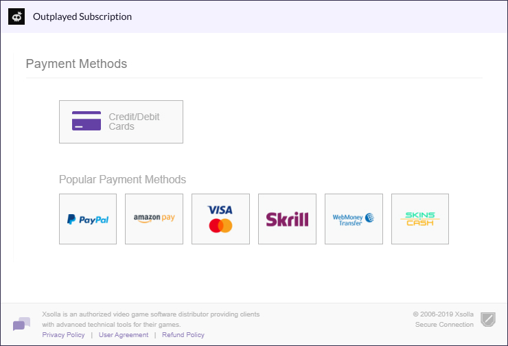
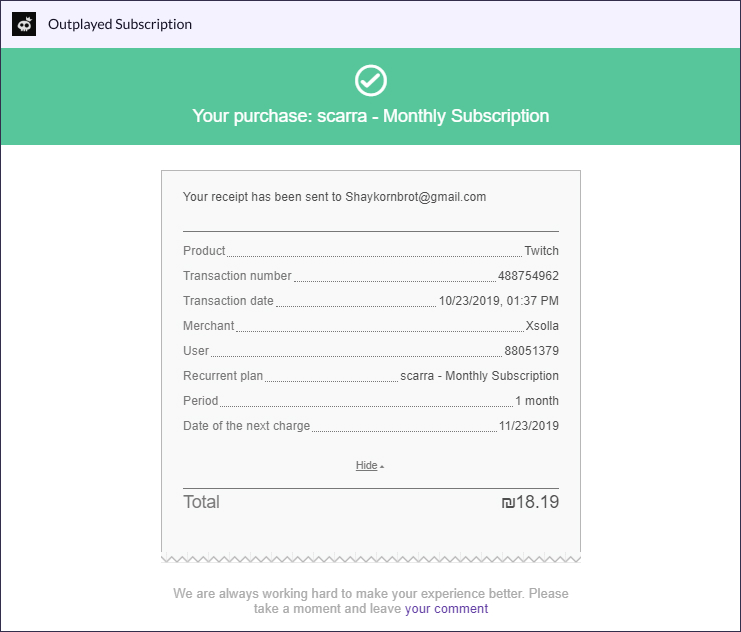
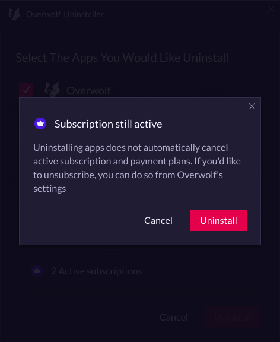

## Subscribing from the app's page

The easiest way for a user to subscribe is going to that app’s page in the Appstore and clicking the "Subscribe" button.

  <a data-fancybox="gallery" data-caption="The app's page (AKA 'OneApp' page), for unsubscribed users" href="../assets/subs-user-flow/one-app.jpg">
    One App page - Unsubscribed
    
      
    
  </a>

## Subscribing using the in-app button

Developers can choose to implement an in-app subscribe button leading directly to the subscription flow. 

  <a data-fancybox="gallery" data-caption="In-app subscribe button" href="../assets/subs-user-flow/outplayed.jpg">
    In-app subscribe button
    
      
    
  </a>

## Features screen and Checkout flow

After clicking "Subscribe", the user reaches a detailed plan page that breaks down all plan features.  
Currently, each app can only have one plan, but in the future multiple plans will be possible, each with different own feature sets.

  <a data-fancybox="gallery" data-caption="Subscription features page" href="../assets/subs-user-flow/features.jpg">
    Subscription features page
    
      
    
  </a>
  <a data-fancybox="gallery" data-caption="quick checkout flow on our payment gateway, XSolla, which supports various payment methods" href="../assets/subs-user-flow/payments.jpg">
    Checkout flow
    
      
    
  </a>
  <a data-fancybox="gallery" data-caption="Once subscription is finalized, the user will get an on-screen confirmation" href="../assets/subs-user-flow/receipt.jpg">
    On-screen purchase confirmation
    
      
    
  </a>
  <a data-fancybox="gallery" data-caption="Once subscribed, the user is returned to the app subscription page. You can view and manage your subscription by clicking on the settings wheel." href="../assets/subs-user-flow/one-app-subscribed.jpg">
     One App page - Subscribed
    
      
    
  </a>
  <a data-fancybox="gallery" data-caption="In addition, once subscription is finalized, an email confirmation will be sent" href="../assets/subs-user-flow/subscription-mail.jpg">
    Email purchase confirmation
    
      
    
  </a>

## Manage active subscriptions

Subbed apps appear in a new settings page where users can easily monitor or cancel their subscriptions as they please. Cancellation takes place at the end of the current subscription period.

  <a data-fancybox="gallery" data-caption="Manage active subscriptions" href="../assets/subs-user-flow/settings-active-subs.jpg">
    Manage active subscriptions
    
      
    
  </a>

## Uninstall / Cancel subscriptions

When a user begins to uninstall Overwolf, they will get a notification warning them about active subscriptions that they might want to cancel for that app.

  <a data-fancybox="gallery" data-caption="Uninstall notification" href="../assets/subs-user-flow/uninstall-subs-notification.jpg">
    Uninstall notification
    
      
    
  </a>
  <a data-fancybox="gallery" data-caption="Uninstall notification popup" href="../assets/subs-user-flow/uninstall-subs-notification-popup.jpg">
    Uninstall notification popup
    
      
    
  </a>
  <a data-fancybox="gallery" data-caption="Once a subscription is successfully canceled, the user will get a confirmation by email" href="../assets/subs-user-flow/cancellation-mail.jpg">
    Cancellation email
    
      
    
  </a>

