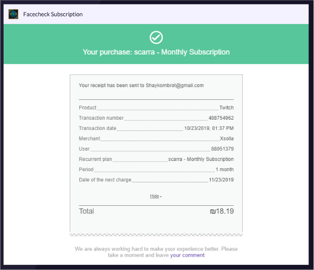

## Subscribe from the app page

To sub to an app, all a user has to do is go to that app’s page in the Appstore and click the "Subscribe" button.

## Subscribe from the in-app button

The developer can choose to implement an in-app subscribe button. 

## Plan features screen

After click "Subscribe", the user gets to the plan detail page that describes all the plan features.  
Currently, each app can have only one plan, but in the features, each app can have several plans, each plan with its own feature set.

## Checkout flow

After the user reviews the feature set and willing to continue, he clicks "Subscribe".  
That’ll send them to a quick checkout flow on our payment gateway, XSolla, that supports various payment methods.

### On-screen purchase confirmation.

Once done, the user gets an on-screen confirmation.

### Email purchase confirmation.

As well as an email confirmation.

## App page for subscribed user

Once a subscription is completed, the user returned to the app subscription page.  
Now, he can manage the subscription when clicking on the settings wheel.

## Manage subscription screen

Subbed apps appear in a new settings page where users can easily monitor or cancel their subscriptions as wanted. Cancellation takes place at the end of the current subscription period.

## Email cancel confirmation

Once a subscription is successfully canceled, the user gets a cancel confirmation by email.

## Uninstall notification

When a user tries to uninstall Overwolf, the user gets a notification about any active subscription that he might want to cancel as well.

