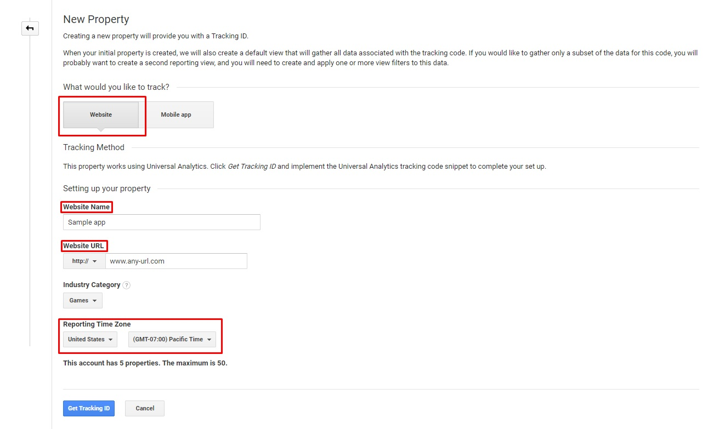
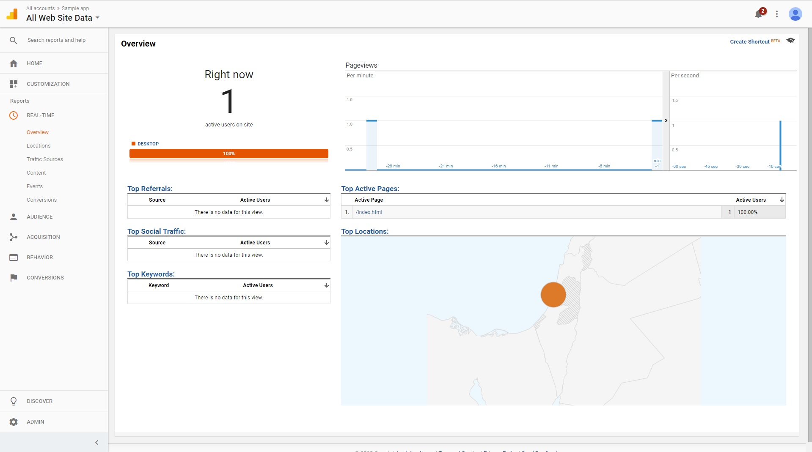

Getting statistics out of your app might prove to be one of the most valuable resources you will encounter.  
Statistics will support your product decision making by providing real user usage data, including showing how users actually interact with your product, where do they drop off, what product abilities are completely ignored and so on.

We recommend using a web analytics service to collect and analyze app data, measure user engagement and improve monetization.

Our preference is the industry standard [Google Analytics](https://marketingplatform.google.com/about/analytics/features/).

We highly encourage you to take the time to implement any chosen analytics service thoroughly.

## Google Analytics: Basic Implementation

### Update your manifest.json

```json
{
"data":{  
   "externally_connectable":{  
      "matches":[  
         "https://*.google-analytics.com",
         "http://www.google-analytics.com"
      ]
   }
}
```

### Create a new GA account and a new property

Select "Website" as your tracked object, enter any website name, website URL and select your preferred reporting time zone.

<div class="box" data-slick='{"slidesToShow": 1}'>
  <a data-fancybox="gallery" data-caption="Create a new property" href="../assets/app-analytics/GA1.jpg">
     Create a new property
    <span class="thumb">
      
    </span>
  </a>
</div>

### Update your index page

Let's assume here that you want to track events in your index page. In your index page e.g. at /index.html, add a reference to the tracking javascript in a separate file:

```html
<!DOCTYPE html>
<html>
<head>
  ...
  <script src="js/index.js"></script>
  ...
</head>
<body>
  ...
</body>
</html>
```

### Update your tracking code

Add the tracking JavaScript e.g. at js/index.js with the Universal Analytics code. Note the “https” at the start of the script address.

```js
// Standard Google Universal Analytics code
(function(i,s,o,g,r,a,m){i['GoogleAnalyticsObject']=r;i[r]=i[r]||function()
   {
      (i[r].q=i[r].q||[]).push(arguments)
   },
   i[r].l=1*new Date();a=s.createElement(o),
   m=s.getElementsByTagName(o)[0];a.async=1;a.src=g;m.parentNode.insertBefore(a,m)
   // Note: https protocol here
})(window,document,'script','https://www.google-analytics.com/analytics.js','ga');

ga('create', 'UA-XXXXX-YY', 'auto');

// Removes failing protocol check. @see: http://stackoverflow.com/a/22152353/1958200
ga('set', 'checkProtocolTask', function(){}); 
ga('require', 'displayfeatures');
ga('send', 'pageview', '/index.html');
```

If that all went well, you should soon see page tracking in Google Analytics, like so:

```html

```

## More info

More information on best practices and hands on guides for implementing google analytics can be found [here.](https://analytics.google.com/analytics/academy/)
