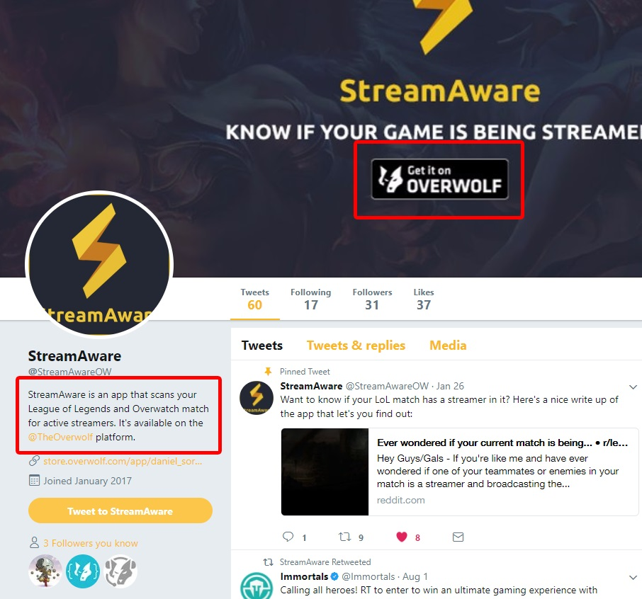

You created your app and you want gamers to know about it and get them to use it. As part of that, you will probably work on marketing and on creating the identity of your brand online.

To make sure that your users don’t get confused, you will need to explain the users that they are going to experience Overwolf as part of the process.

## Goals

Best user experience.
Transparency and clear messaging for your users.
Prevent user surprises. users need to understand what they are installing and why.

## What is "Get it on Overwolf"

To achieve the perfect communication, you should use the following “Get it on Overwolf” badge on your social media pages and websites. We suggest not to use “Powered by Overwolf” because this implies that Overwolf is some sort of engine that sits under the hood, whereas in reality it’s a consumer product that your users will interact with.

The right badge to use:

## Why

The potential user is looking at your website and sees your brand. 
When he clicks on your “Download now”, he will see the Overwolf installer.
If you won’t explain what Overwolf is before the user clicks on the download link, you may lose this potential user because he doesn’t understand what he is going to download.

As a developer, being in-line with these communication guidelines will benefit you on the long run, as users will understand what they are getting when they download your product. Being part of the Overwolf platform and telling that to your users will help them to understand the app’s user experience and how to control it.

To sum up:
Do not use direct download link on your website, the hyperlink of the download button should direct the user to your app’s page on the Overwolf Appstore.
Use the language “Get it on Overwolf” and not “Download Now”.
On social media, mention that your product is available on the Overwolf Appstore
Any marketing assets of your app should mention Overwolf.

## Examples

  <a data-fancybox="gallery" data-caption="LoLwiz" href="../assets/communication-guidelines/streamaware-overwolf.jpg">
    StreamAware’s Twitter page
    
      
    
  </a>
  <a data-fancybox="gallery" data-caption="PUBG Tracker" href="../assets/communication-guidelines/THtwitterdisc.png">
    Trophy Hunter’s Twitter page
    
      
    
  </a>

