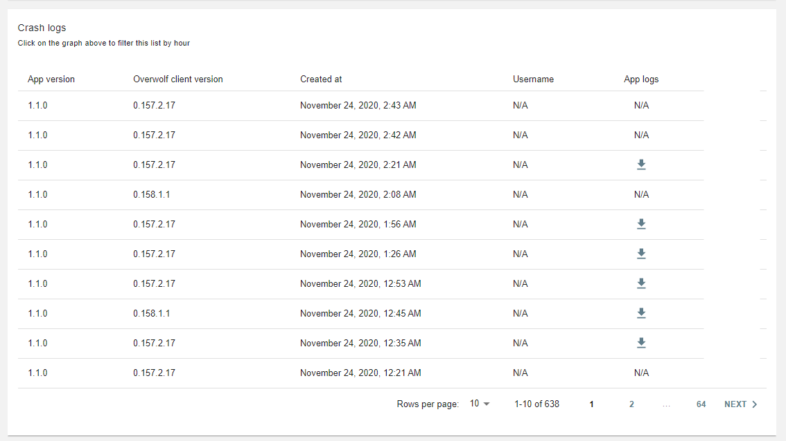

In this article, we'll go over the process of viewing the crash reports for your apps and understand the different types of reports.

## Overview

Whenever your app crashes unexpectedly, the crash logs are uploaded automatically to our servers by the OW client. If there is no available internet connection or other reason preventing the client from uploading the crash logs, the client will automatically try to upload it every several hours until success.

Each crash log is a zip package that contains all your app's crash logs, named by your app's windows names.  e.g.:  
background.html.log, background.html.1.log, ads.html.log, ads.html.1.log, ads.html.2.log, etc.

After the logs collected by our servers, you can view and analyze them through the OW dev console.

## Crash reports types

We currently have several views on your app's crash logs to find and filter crashes easily.

### Crashes over time

### Crash logs

For each crash incident, you can get various details:

* App version
* Overwolf client version
* Created at
* Username
* App logs

### Filter crashes by hour

If you are interested in getting the crash logs for a specific timeframe, you can filter by the hour:

### Download crash logs

For each crash, you can easily download the user's support package that is automatically uploaded to our servers so that you can examine, analyze, and find errors and issues. Just hit the grey arrow next to the relevant crash: 

### Crash rate compared to peers

You can view your crashes rate compared to similar apps to determine if your app's health quality is relatively stable or not.

