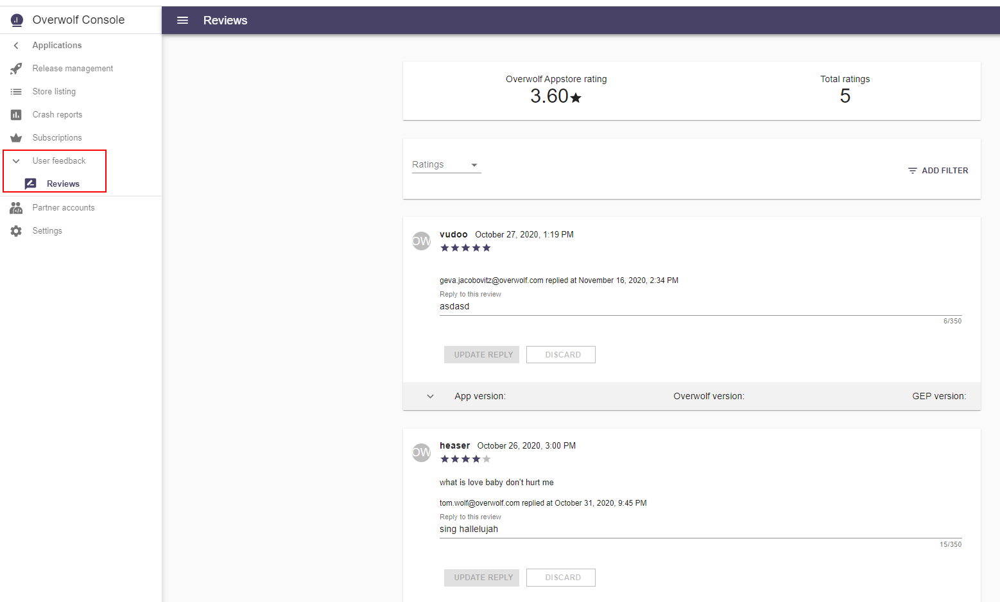

Users can leave reviews and rate your app in Overwolf’s AppStore. You can browse these ratings and reviews and reply to users from the dev console.

## Why is this important

Replying to reviews engages your users and makes them feel valued, helping to build loyalty. When you respond to negative reviews, it indicates how and when you'll address the feedback, where possible. Users will be more likely to leave a good rating and share your app following a positive interaction.

## Best practices

* Keep it concise and clear when addressing your user’s feedback.
* Strive for a friendly tone that’s consistent with the voice of your brand.
* Remain positive and respectful, even if it seems the user is attacking ("Your feedback helps us to improve") Clearly acknowledge the reviewer's feedback, and let them know you’re working on addressing the issue ("This is a known issue, and we're doing our best on working to fix it.")
* Use proper grammar and spelling. We advise using [Grammarly](https://app.grammarly.com/). 

## Pro Tips

* Personalizing your responses rather than using generic responses for similar reviews (e.g. "Hey Alex, thanks for your feedback.").
* When you release an app update that fixes issues mentioned in older reviews, consider replying to relevant reviews to tell these users about the fix.

## Manage your user's reviews

From the dev console, you can find the "User feedback" on the left navigation bar.

On the right side you can see the number of reviews, your average rating, and all the reviews in a list.

### Reply to review

Once the user adds a review on your app, it displays in both places.

On the app's page on the OW AppStore:

And in the dev console "rating and reviews" page, where you can reply to each feedback:

#### Few important notes

* Only one reply per review. This means, after adding your response, you can only remove or edit it. But not add another reply.
* The user can't answer your reply, create a thread/discussion, etc. (he can edit his review, though)
* The user does not get any notification that you replied to his review. 

In future versions, we will add more features like user notifications when we reply to the review.

### Support info

When a user posts a review on your app, OW automatically pulls some basic info from his OW client:

As you can see, you can find here a lot of support info on the user that enables you to provide higher quality and relevant reply to the review.

* App version (known issue: currently, the store version of your app is presented here. We will fix it soon, as it should display the installed version).
* OW version.
* GEP version.
* Main and Secondary screen sizes.
* Main and Secondary screen DPI.
* Operation system.
